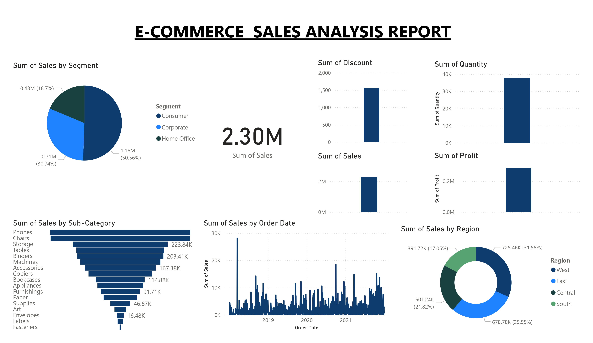

# E-Commerce Sales Analysis Report

## Overview
This project is a comprehensive analysis of e-commerce sales data using *Power BI Desktop*. The report provides insights into:
- Regional sales performance
- Sub-category sales trends
- Segment-wise sales contribution
- Sales over time (2019-2021)

The report aims to assist businesses in identifying key performance areas and opportunities for growth.

## Features
- *Regional Sales Analysis*: Breaks down total sales by region (West, East, Central, South).
- *Category and Sub-Category Insights*: Visualizes sales for products like Phones, Chairs, Storage, and more.
- *Segment-Wise Sales*: Displays sales contributions from Consumer, Corporate, and Home Office segments.
- *Time Series Analysis*: Tracks sales trends and quantities sold over the years.
- *Profit and Discount Analysis*: Examines the relationship between profit margins and discounts offered.

## Tools Used
- *Power BI Desktop*: For creating interactive dashboards and visualizations.
- *Data Sources*: E-commerce transactional data.

## Key Insights
- The highest sales contribution comes from the Consumer segment.
- Phones and Chairs are the top-performing sub-categories.
- The West region leads in overall sales revenue.
- Discount levels and their impact on profits are highlighted.

## Screenshots

## How to View the Report
1. Open the .pbix file using *Power BI Desktop*.
2. Navigate through the interactive dashboard to explore the analysis.
